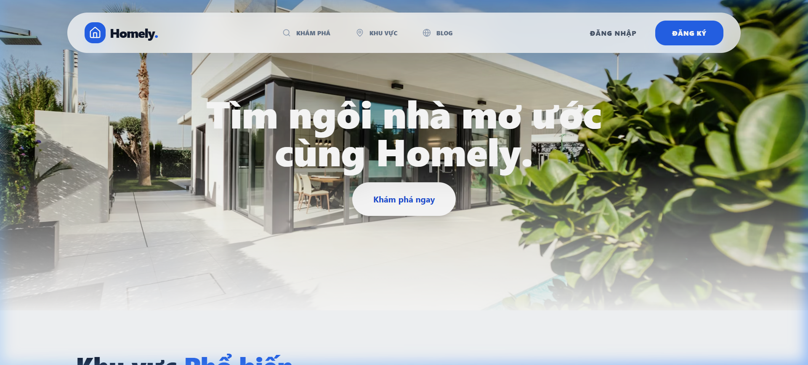
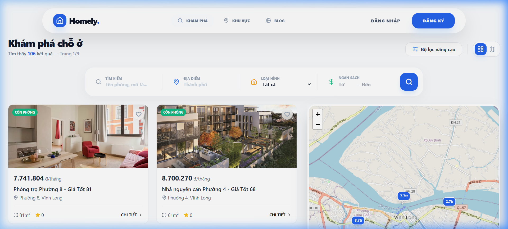

<div align="center">

# 🏡 Homely - Smart Housing Platform

**Nền tảng tìm kiếm và cho thuê phòng trọ thông minh tại Việt Nam**

[](https://homely-web-project.vercel.app/)
[](https://homely-api.onrender.com)
[](https://react.dev)
[](https://nodejs.org)
[](https://www.mongodb.com)

[**Khám phá ngay**](https://homely-web-project.vercel.app/) • [**Báo lỗi**](https://github.com/vinhn1/Homely_Web/issues) • [**Tài khoản Demo**](#-tài-khoản-demo)

</div>

---

## 📸 Preview Dự án

<div align="center">
  
  <br><br>
  <div style="display: flex; justify-content: center; gap: 10px;">
    
    
  </div>
</div>

---

## 📖 Giới thiệu

**Homely** là một giải pháp Full-stack hiện đại nhằm giải quyết bài toán tìm kiếm và quản lý nhà trọ tại Việt Nam. Dự án được xây dựng với mục tiêu mang lại trải nghiệm mượt mà, minh bạch và an toàn cho cả người thuê trọ và chủ nhà.

> [!TIP]
> **Điểm nổi bật:** Dự án tích hợp hệ thống **Real-time Chat** (Socket.io) giúp chủ nhà và khách thuê kết nối tức thì, cùng với bản đồ tương tác **Leaflet** giúp tìm kiếm phòng theo khu vực một cách trực quan.

---

## ✨ Tính Năng Nổi Bật

### 🌐 Phân Quyền Người Dùng (RBAC)
- **Tenant (Người thuê):** Tìm kiếm, bộ lọc thông minh, lưu yêu thích, đặt phòng và trò chuyện trực tiếp.
- **Owner (Chủ nhà):** Đăng tin (kèm upload nhiều ảnh), quản lý bài đăng, duyệt yêu cầu bản đặt phòng và Dashboard thống kê.
- **Admin (Quản trị):** Kiểm duyệt bài đăng, xác thực chủ nhà, quản lý người dùng và xử lý báo cáo vi phạm.

### ⚡ Kỹ Thuật Đã Áp Dụng
- 💬 **Real-time Engine:** Hệ thống thông báo và tin nhắn tức thời sử dụng Socket.IO.
- 🗺️ **Interactive Maps:** Tích hợp Leaflet Maps để định vị và tìm kiếm theo bán kính.
- 🛡️ **Bảo mật:** JWT Authentication, Role-based Protection, và Validation dữ liệu với Zod.
- ☁️ **Media:** Quản lý và tối ưu hóa hình ảnh thông qua Cloudinary CDN.
- 📊 **State Management:** Kết hợp Zustand (Global State) và TanStack Query (Server State/Caching).
- 🎨 **UX/UI:** Giao diện Premium với TailwindCSS và chuyển động mượt mà từ Framer Motion.

---

## 🛠️ Tech Stack

### Frontend
- **Framework:** React 19 + Vite
- **Styling:** TailwindCSS + Lucide Icons + Shadcn/UI
- **State:** Zustand + TanStack Query v5
- **Animation:** Framer Motion
- **Map:** Leaflet + OpenStreetMap

### Backend
- **Runtime:** Node.js + Express 5
- **Database:** MongoDB + Mongoose (NoSQL)
- **Real-time:** Socket.IO
- **Auth:** JSON Web Token (JWT) + bcryptjs
- **Validation:** Zod

---

## 📁 Cấu Trúc Dự Án

```bash
Homely/
├── 📁 frontend/           # React + Tailwind + Zustand
│   ├── 📁 src/components/ # Shared UI components (Atomic Design)
│   ├── 📁 src/pages/      # Page components
│   └── 📁 src/store/      # Zustand stores (Auth, Chat, etc.)
├── 📁 backend/            # Express API + Socket.IO
│   ├── 📁 src/models/     # Mongoose schemas (12 models)
│   ├── 📁 src/routes/     # API endpoints
│   └── 📁 src/controllers/# Business logic (Clean Arch)
└── 📁 assets/             # Project screenshots & branding
```

---

## ⚙️ Hướng Dẫn Cài Đặt

### 1. Clone & Install
```bash
git clone https://github.com/vinhn1/Homely_Web.git
cd Homely
```

### 2. Cài đặt Backend
```bash
cd backend
npm install
# Tạo .env với MONGODB_URI, JWT_SECRET, CLOUDINARY_KEYS
npm run dev
```

### 3. Cài đặt Frontend
```bash
cd ../frontend
npm install
# Tạo .env với VITE_API_URL
npm run dev
```

---

## 🔑 Tài Khoản Demo

| Vai trò | Email | Mật khẩu |
|---|---|---|
| **Admin** | `admin@homely.vn` | `Admin@123` |
| **Owner** | `owner@homely.vn` | `Owner@123` |
| **Tenant** | `user@homely.vn` | `User@123` |

---

## 📄 Giấy phép

Phân phối theo Giấy phép MIT. Xem `LICENSE` để biết thêm thông tin.

---

<div align="center">

**Được xây dựng với 💖 bởi [Hoang Vinh](https://github.com/vinhn1)**

*Dự án tâm huyết phục vụ danh mục đầu tư (Portfolio) và định hướng Intern/Junior Fullstack Developer.*

[](https://github.com/vinhn1)

</div>
